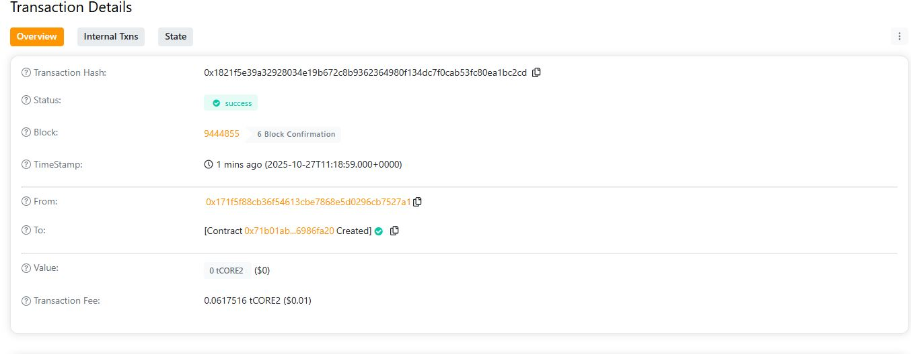

// README.md
# CrypteraLabs

## Project Title
CrypteraLabs

## Project Description
CrypteraLabs is a decentralized crowdfunding and innovation support platform built on Ethereum. It allows users to contribute funds securely and transparently to innovative blockchain-based projects.

## Project Vision
To empower innovators and creators by providing a trustless, transparent, and efficient platform for funding and collaboration within the blockchain ecosystem.

## Key Features
- **Secure Contributions:** Users can contribute ETH directly to projects via the smart contract.
- **Transparent Fund Management:** Owners can withdraw funds only within contract rules.
- **Project Summary View:** Public visibility into total funds raised and project owner details.

## Future Scope
- Integrate token-based rewards for contributors.
- Develop DAO-based governance for project decision-making.
- Add milestone-based automatic fund release.
- Expand to multi-chain support for greater accessibility.

H address:0x1821f5e39a32928034e19b672c8b9362364980f134dc7f0cab53fc80ea1bc2cd

